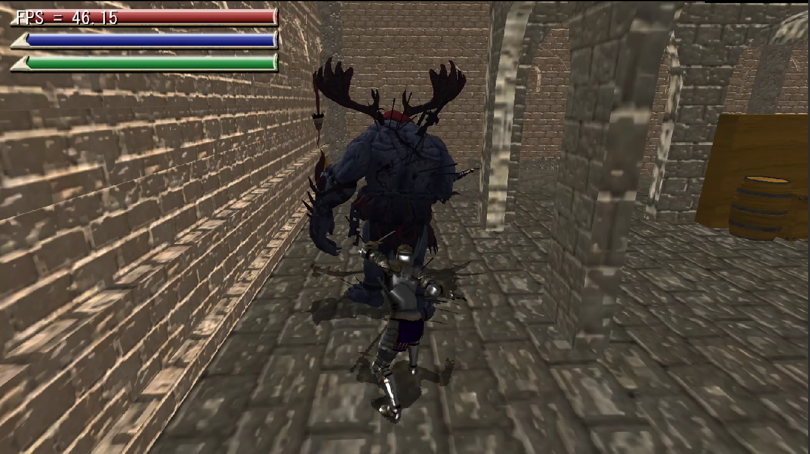

# SPECIAL SENSE
河原電子ビジネス専門学校  
ゲームクリエイター科2年　中谷来斗  
# 目次

- [SPECIAL SENSE](#special-sense)
- [目次](#目次)
- [1. 作品概要](#1-作品概要)
  - [・SPECIAL SENSE(スペシャルセンス)](#special-senseスペシャルセンス)
  - [・使用ゲームエンジン](#使用ゲームエンジン)
  - [・使用ツール](#使用ツール)
  - [・使用言語](#使用言語)
  - [・開発環境](#開発環境)
  - [・制作人数](#制作人数)
  - [・開発期間](#開発期間)
  - [・コンテスト](#コンテスト)
- [2. 操作説明](#2-操作説明)
- [3. 担当ソースコード](#3-担当ソースコード)
- [4. 透視能力](#4-透視能力)
- [5.ブルーム](#5ブルーム)
- [6.クリティカル攻撃の判定](#6クリティカル攻撃の判定)
- [7.パス移動](#7パス移動)
- [8.壁との衝突判定](#8壁との衝突判定)
- [9.ゲームでこだわった部分](#9ゲームでこだわった部分)
  - [・ライティングによる演出](#ライティングによる演出)

# 1. 作品概要 
## ・SPECIAL SENSE(スペシャルセンス) 
３人称視点のアクション型ステルスゲームで、 
敵に見つからないように宝箱を探すゲームです。

▼紹介動画  
<iframe width="560" height="315" src="https://www.youtube.com/embed/syojzjgXIzk" title="YouTube video player" frameborder="0" allow="accelerometer; autoplay; clipboard-write; encrypted-media; gyroscope; picture-in-picture" allowfullscreen></iframe>
  
    
## ・使用ゲームエンジン 
学校内製エンジンを改造して使用 
## ・使用ツール 
Visual Studio 2019  
3ds Max 2021  
Adobe Photoshop 2022   
Git  
## ・使用言語 
C++  
HLSL  
## ・開発環境 
Windows10   
DirectX12  
## ・制作人数 
4人  
## ・開発期間 
2021年2月～2021年8月  

## ・コンテスト

 U22プログラミングコンテスト2022の事前審査を通過。  

 上位32作品に選出されました。

# 2. 操作説明

</img> 

# 3. 担当ソースコード

▼担当ソースコード  
・BackGround.cpp  
・BackGround.h  
・box.cpp  
・box.h  
・EnemyPath.cpp  
・EnemyPath.h  
・Fade.cpp  
・Fade.h  
・Floor.cpp  
・Floor.h  
・Game.cpp  
・Game.h  
・GameCamera.cpp  
・GameCamera.h  
・GameClear.cpp  
・GameClear.cpp  
・GameSound.cpp  
・GameSound.h  
・index.cpp  
・index.h  
・Menu.cpp  
・Menu.h  
・PAUSE.cpp  
・PAUSE.h  
・player.cpp  
・player.h  
・Retry.cpp  
・Retry.h  
・Title.cpp  
・Title.h  
・UI.cpp  
・UI.h  
・CollisionObject.cpp  
・CollisionObject.h  
・Bloom.cpp  
・Bloom.h  
・FontRender.cpp  
・FontRender.h  
・IRenderer.cpp  
・IRenderer.h  
・MapChipRender.cpp  
・MapChipRender.h  
・LevelRender.cpp  
・LevelRender.h  
・LightALL.cpp  
・LightALL.h  
・ModelRender.cpp  
・ModelRender.h  
・PostEffect.cpp  
・PostEffect.h  
・RenderingEngine.cpp  
・RenderingEngine.h  
・ShadowMapRender.cpp  
・ShadowMapRender.h  
・SpriteRender.cpp  
・SpriteRender.h  
・model.fx  
・PostEffect.fx  
・ShadowReciever.fx  
・sprite.fx

# 4. 透視能力

モデルを描画するModelRenderクラスを改造。  
通常合成と半透明合成が出来る２つの関数を用意し、  
ボタン操作で切り替えれるようにしている。  

▼通常合成  
</img> 

▼半透明合成  
</img> 

# 5.ブルーム

川瀬式ブルームを実装。  
1.通常シーンをオフスクリーンレンダリング後、輝度が高いピクセルを抽出する。    
2.ブラーとダウンサンプリングをかけながら複数枚のテクスチャを作成する。    
3.複数枚のテクスチャの平均を取って加算合成する。  
  
▼通常シーン  
 </img>   
▼輝度抽出したテクスチャ  
</img>   
▼ブラーをかけながらダウンサンプリングしたテクスチャ  
</img>   
▼加算合成後  
</img>   

# 6.クリティカル攻撃の判定

突き攻撃の際、アニメーション開始前に、  
プレイヤーの前方向にコリジョンを生成し、  
それがエネミーのコライダーに当たったかどうかで、  
クリティカル攻撃の成功か失敗かの判定をとっている.  

▼クリティカル攻撃  
</img> 

# 7.パス移動

3dsMAX上でパスを設置し、レベルで保存 読み込みを行う。  
読み込んだパスのポジションに向かって移動するようする。  

</img> 

# 8.壁との衝突判定

エネミーがパスの場所に戻る際、コライダーをパスの座標まで飛ばし、障害物に衝突するかどうかの判定を取る。  
衝突したら現在指定されているパスを次のパスに指定する。これを障害物に衝突しなくなるまで繰り返す。  
これによってエネミーが壁に突っ込まないようにしました。  

</img> 

# 9.ゲームでこだわった部分

## ・ライティングによる演出
イベントが起きた時に周りを暗くし、見てほしいところにスポットライトを当てて、  
目立つように演出しています。  
  
▼クリティカル攻撃時  
</img>   

▼宝箱があるエリアに入った時  
</img>   
